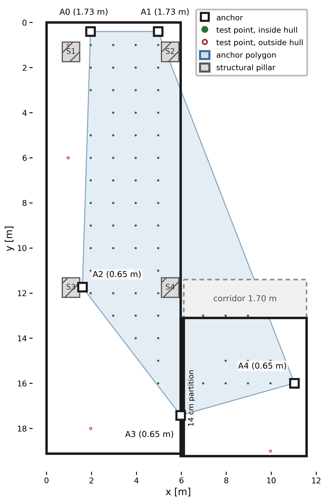

# MK8000 vs DWM1001C - UWB indoor positioning

Raw measurements and code for the paper **"A comparison between two indoor positioning UWB systems"**
(Ciorchină, Petrița, Stoichițoiu - Politehnica University Timișoara).

Two UWB kits - **MKSemi MK8000** (EBYTE EWM550) and **Qorvo DWM1001C** - are compared in an L-shaped indoor area with the
same five-anchor layout. The tag position is computed from two-way-ranging distances with three estimators: **OLS**,
**per-point WLS** and **RANSAC**.



## Results

Horizontal position error [cm]: mean, sample standard deviation and 95th percentile over the 64 interior test points,
and mean over all 68 points (64 interior + 4 exterior control points). Recomputed from `data/`:

| System   | Estimator  | Mean (64) | Std (64) | p95 (64) | Mean (68) |
|----------|------------|----------:|---------:|---------:|----------:|
| DWM1001C | OLS        |     105.0 |     83.6 |    254.1 |     104.1 |
| DWM1001C | WLS        |      69.4 |     43.3 |    148.7 |      70.2 |
| DWM1001C | **RANSAC** |  **61.2** |     39.6 |    137.3 |  **63.0** |
| MK8000   | OLS        |     247.7 |    208.9 |    587.0 |     249.0 |
| MK8000   | **WLS**    | **159.7** |    175.5 |    467.9 |  **164.6** |
| MK8000   | RANSAC     |     203.7 |    208.4 |    681.8 |     200.1 |

The best estimator differs per platform: outlier rejection (RANSAC) for DWM1001C, continuous down-weighting (WLS) for
MK8000. The per-anchor ranging error model (Table II of the paper) is in `results/table_ii.csv`.

## Run it

```bash
pip install -r requirements.txt
python uwb.py            # recompute Tables II and III; exit code 0 if they match the paper
python plot_fig1.py      # regenerate the figure
jupyter lab worked_example.ipynb
```

## Contents

```
data/                  raw measurements, 30 ranging cycles per test point, interior + exterior files per system
uwb.py                 analysis: horizontal projection, anchor selection, OLS / WLS / RANSAC, error model
plot_fig1.py           test-area figure
worked_example.ipynb   walk-through with results (already executed)
results/               errors_per_point.csv, table_ii.csv, table_iii.csv  (written by uwb.py)
figures/               fig1_test_area.png / .pdf
```

## Method

Per test point and system:

1. Project each slant range to the horizontal plane (anchor heights 1.73 / 0.65 m, tag 1.00 m) and average the cycles.
2. **Reference anchor** = best quality (tie: the farther anchor). Quality is the mean SNR for MK8000; DWM1001C exposes no
   SNR, so it is the consistency of the repeated ranges (smaller standard deviation = better).
3. If more than four anchors have data, the weakest one is dropped (tie: the nearer one).
4. Trilaterate the linearised TOA system (reference anchor subtracted): OLS; WLS with weights 1/variance of the repeated
   ranges at that point; deterministic RANSAC over all 3-anchor subsets with consensus threshold
   tau = 2.5 x median of the per-anchor ranging residual (0.95 m for DWM1001C, 2.59 m for MK8000).

## Data

One row per ranging cycle. `point_id`, `cycle_idx` (1-30), ground truth `gt_x, gt_y, gt_z` [m], measured distances
`r_AN0 ... r_AN4` [m] to anchors A0-A4 (empty = no range in that cycle), `n_valid`, `region` (`punct_interior` /
`punct_exterior`). MK8000 files also have `snr_AN*` and `rssi_AN*`; DWM1001C files have `pos_x, pos_y, pos_z`
(position computed by the PANS firmware) and `qf` (quality factor). Anchor coordinates are in `uwb.py`.

* `*_measurements.csv` - 64 interior points; `*_exterior.csv` - 4 exterior control points (IDs 1, 26, 112, 129).
* DWM1001C point 1 was recorded six times; all 180 cycles are pooled (this reproduces the paper's numbers).
* DWM1001C keeps at most four anchors per cycle, so far anchors are often missing (anchor A4 is measured at only 24 of
  the 68 points); at control point 129 only A2, A3 and A4 are in range.

## Citation and license

See `CITATION.cff`. Code and data: MIT license. Pillar positions in the figure were measured from the published figure
(about +/- 2 cm).
